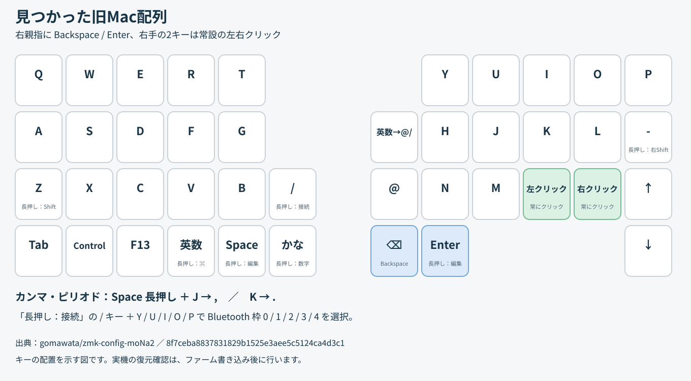

# zmk-config-moNa2



## このworktreeの位置づけ

これは `restore/original-mac` の復元variantです。旧Mac配列の一致契約を優先し、`main` やMac/COROPIT候補との自動マージ対象にはしません。

- [v2 main](../zmk-config-moNa2-v2/README.md): 基準となる別worktree
- [Mac/COROPIT 1600 CPI候補](../zmk-config-moNa2-mac-20260913/README.md): 用途とCPIが異なる別variant
- [旧Mac配布物](../mona2-original-mac-delivery/README.md): source、UF2、hash、復旧手順を残す固定証跡
- [キーマップ変更履歴サイト](../mona2-keymap-site/README.md): 履歴を管理するがfirmwareは更新しない

配布物のsource commitは現在のHEADと一致しない場合があります。採用前に対象機器、配列、CPI、lock、UF2 hash、実機確認を組で照合します。

## 旧 Mac 配列を使う

旧設定から復元した配列、右側のBackspace／Enter／マウスキー、COROPITトラックボールの扱いは
[旧 Mac 配列の復元](docs/original-mac-layout.md) を参照してください。

配列原本は保持し、ユーザー指定の差分として右トラックボールのCPIだけを600からドライバ上限の3200へ変更しています。

# COROPITを使用するへ

この復元ブランチではCOROPIT用の設定（`cpi = <3200>`、X/Y反転）がすでに適用済みです。
PMW3610ドライバとDevicetree bindingのCPI範囲は200〜3200（200刻み）で、3200が上限です。
右手用UF2を書き換えるだけでよく、通常は設定リセットを行う必要はありません。配列とBluetooth接続登録は保持されます。
以下は設定内容の参照です。

mona2_r.overlay

旧設定（600 CPI）
```
  trackball_central: trackball_central@0 {
        status = "okay";
        compatible = "pixart,pmw3610";  //トラボセンサ用のドライバとバインド
        reg = <0>;
        spi-max-frequency = <2000000>;
        irq-gpios = <&gpio0 2 (GPIO_ACTIVE_LOW | GPIO_PULL_UP)>; //P0.02を指定(MOTION)
        cpi = <600>;
        //swap-xy;
        invert-x; //COROPIT版で有効
        invert-y; //COROPIT版で有効
        evt-type = <INPUT_EV_REL>;
        x-input-code = <INPUT_REL_X>;
        y-input-code = <INPUT_REL_Y>;
    };
};

```
**現在の設定（3200 CPI）**
```
  trackball_central: trackball_central@0 {
        status = "okay";
        compatible = "pixart,pmw3610";  //トラボセンサ用のドライバとバインド
        reg = <0>;
        spi-max-frequency = <2000000>;
        irq-gpios = <&gpio0 2 (GPIO_ACTIVE_LOW | GPIO_PULL_UP)>; //P0.02を指定(MOTION)
        cpi = <3200>;
        //swap-xy;
        invert-x; //COROPIT版ではコメントアウトを外す
        invert-y; //COROPIT版ではコメントアウトを外す
        evt-type = <INPUT_EV_REL>;
        x-input-code = <INPUT_REL_X>;
        y-input-code = <INPUT_REL_Y>;
    };
};

```
